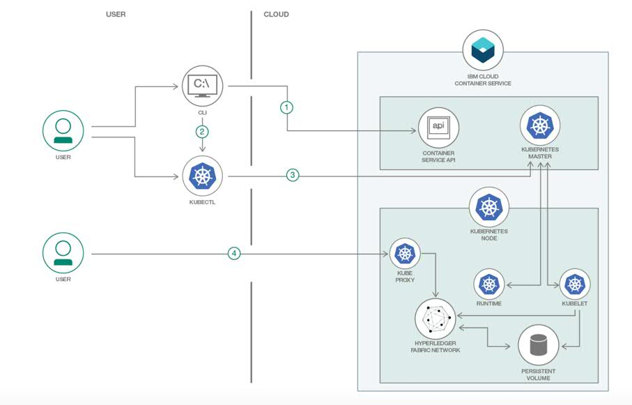
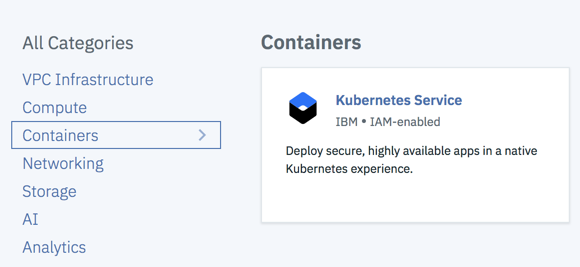
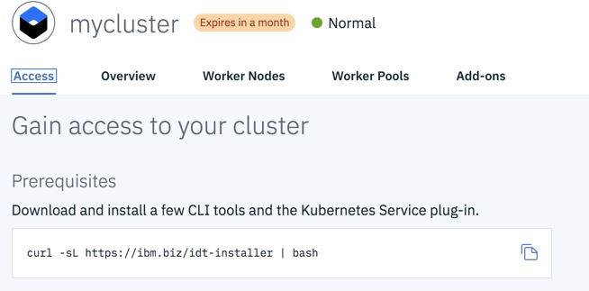
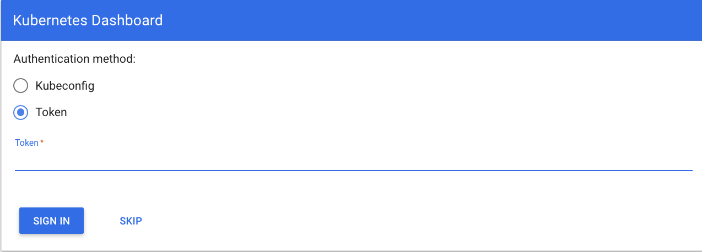
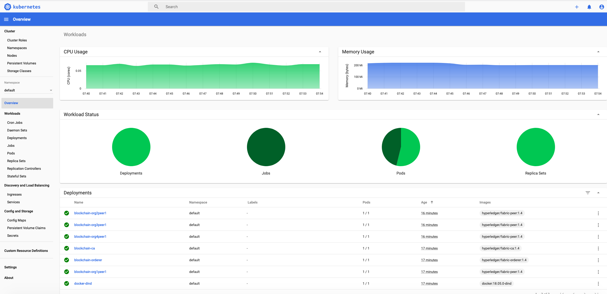

*阅读本文的其他语言版本：[English](README.md)。*
# 使用 IBM Cloud 上的 Kubernetes API 部署区块链网络

区块链是一个不可改变的共享分类账，用于记录交易历史信息。Linux 基金会的 Hyperledger Fabric 是 IBM 致力于的区块链软件实现，是一种许可网络。无论开发何种区块链用例，首先都要为创建和部署应用建立一个 Hyperledger Fabric 开发环境。Hyperledger Fabric 网络可通过多种方式进行设置。 
* [Hyperledger Fabric 网络内部部署](http://hyperledger-fabric.readthedocs.io/en/release-1.0/build_network.html)
* 使用托管在 [IBM Cloud](https://console.bluemix.net/) 上的[区块链即服务](https://console.bluemix.net/catalog/services/blockchain)。IBM Cloud 通过 Starter Membership Plan 和 Enterprise Membership Plan 为您提供区块链即服务。
* 使用 [IBM Cloud Container Service](https://console.bluemix.net/containers-kubernetes/catalog/cluster) 上的 Kubernetes API 的 Hyperledger Fabric 网络

本 Code Pattern 演示**使用 IBM Cloud Container Service 上的 Kubernetes API 在 Hyperledger Fabric 上**设置业务网络所涉及的步骤。 

在 IBM Cloud 上托管 Hyperledger Fabric 网络可为您提供诸多好处，比如，多个用户可以在同一设置下工作，该设置可以用于不同的区块链应用，以及可以重复使用设置等等。请注意，Kubernetes 上的区块链网络设置适用于演示方案，但是对于生产，推荐使用 IBM Cloud 上托管的 IBM 区块链即服务。

#### Kubernetes 集群

[IBM Cloud Container Service](https://console.bluemix.net/containers-kubernetes/catalog/cluster) 支持创建免费集群，配备 2 个 CPU、4 GB 内存和 1 个工作节点。可用于熟悉并测试 Kubernetes 功能。但是，它们缺乏 NFS 文件持久存储以及持久卷等功能。

要设置集群以获得最大的可用性和容量，IBM Cloud 支持您创建完全可定制的生产就绪型集群，即 _标准集群_。_标准集群_ 支持高度可用的集群配置，比如，在不同地区运行两个集群，每个集群设有多个工作节点。请访问 https://console.bluemix.net/docs/containers/cs_planning.html#cs_planning_cluster_config， 查看其他高度可用的集群配置选项。

本 Code Pattern 使用 IBM Cloud 提供的 _免费集群_，可用于进行概念验证。它还为您提供了脚本，可自动执行使用 IBM Cloud 上的 Kubernetes API 设置 Hyperledger Fabric 网络的流程。

读者完成本 Code Pattern 之后，将会掌握如何：

* 根据网络拓扑结构修改配置文件
* 在 Kubernetes 集群上部署 Hyperledger Fabric 网络

## 操作流程

  

1. 登录到 IBM Cloud CLI，对 IBM Cloud Container Service 插件进行初始化。
2. 利用 CLI 设置 Kubernetes 集群环境，下载 Kubernetes 配置文件。下载完配置文件后，设置 KUBECONFIG 环境变量。
3. 运行脚本以在 Kubernetes 集群上部署 Hyperledger Fabric 网络。
4. 访问 Kubernetes 仪表板。

## 包含的组件

* [Hyperledger Fabric](https://hyperledger-fabric.readthedocs.io/)：Hyperledger Fabric 是适用于分布式分类账解决方案的平台，由模块化的架构提供支持，可交付高水平的机密性、灾备能力、灵活性和可扩展性。

* [IBM Cloud Container Service](https://console.bluemix.net/containers-kubernetes/catalog/cluster)：IBM Container Service 支持编排智能调度、自我修复以及水平伸缩功能。

## 包含的技术

* [区块链](https://en.wikipedia.org/wiki/Blockchain)：区块链是一种数字化、去中心化的公共分类账，涵盖网络中的所有交易。

* [Kubernetes 集群](https://kubernetes.io/docs)：在 Kubernetes 引擎中，容器集群包含至少一个集群主节点和多个工作节点。容器集群是 Kubernetes 引擎的基础。

## 观看视频

[](http://v.youku.com/v_show/id_XMzY0NDg0OTU1Ng==.html)

## 使用的 Kubernetes 概念
* [Kubernetes Pod](https://kubernetes.io/docs/concepts/workloads/pods/pod/) - Pod 表示 Kubernetes 集群中可部署的最小单元，用于对必须被视为单个单元的容器进行分组。
* [Kubernetes 作业](https://kubernetes.io/docs/concepts/workloads/controllers/jobs-run-to-completion/) - 一个作业可创建一个或多个 Pod，并确保成功终止指定数量的 Pod。Pod 成功完成之后，该作业会跟踪成功完成情况。
* [Kubernetes 部署](https://kubernetes.io/docs/concepts/workloads/controllers/deployment/) - 部署是一种 Kubernetes 资源，您可以在此指定运行应用所需的容器和其他 Kubernetes 资源，比如持久存储、服务或注释。
* [Kubernetes 服务](https://kubernetes.io/docs/concepts/services-networking/service/) - Kubernetes 服务集合了一系列的 Pod，并为集群中面向其他服务的 Pod 提供网络连接，无需公开每个 Pod 的真实私有 IP 地址。
* [Kubernetes 持久卷 (PV)](https://kubernetes.io/docs/concepts/storage/persistent-volumes/) - 持久卷是用户*请求获得*持久存储（比如 NFS 文件存储）的一种方式。

## 步骤

按照这些步骤来设置并运行本 Code Pattern。 

1. [在 IBM Cloud 上创建 Kubernetes 集群](#1-create-a-kubernetes-cluster-on-ibm-cloud)
2. [设置 CLI](#2-setting-up-clis)
3. [获得 Kubernetes 集群访问权限](#3-gain-access-to-your-kubernetes-cluster)
4. [将 Hyperledger Fabric 网络部署到 Kubernetes 集群](#4-deploy-hyperledger-fabric-network-into-kubernetes-cluster)
5. [测试已部署的网络](#5-test-the-deployed-network)
6. [查看 Kubernetes 仪表板](#6-view-the-kubernetes-dashboard)

### 1. 在 IBM Cloud 上创建 Kubernetes 集群

* 使用 GUI 通过 [IBM Cloud Container Service](https://console.bluemix.net/containers-kubernetes/catalog/cluster) 创建 Kubernetes 集群。本 Code Pattern 使用 _免费集群_。

  
  
  注意：设置和配置集群最长需要 15 分钟。


### 2. 设置 CLI

* 安装 [IBM Cloud CLI](https://console.bluemix.net/docs/cli/reference/bluemix_cli/get_started.html#getting-started)。使用 IBM Cloud CLI 运行命令的前缀为 `bx`。

* 安装 [Kubernetes CLI](https://kubernetes.io/docs/tasks/tools/install-kubectl/)。使用 Kubernetes CLI 运行命令的前缀为 `kubectl`。

* 使用以下命令安装容器服务插件。
  ```
  bx plugin install container-service -r Bluemix```

### 3. 获得 Kubernetes 集群访问权限
  
  访问 [IBM Cloud Dashboard](https://console.bluemix.net/dashboard/apps)。选择创建集群所在的 Cloud Foundry 组织和 Cloud Foundry 空间。
  
  * 检查集群的状态：`IBM Cloud Dashboard -> <your cluster> -> Worker Nodes`。如果状态不是 `ready`，那么您需要等待一段时间才能继续。
    
    
    
  * 集群准备就绪之后，打开 Access 选项卡：`IBM Cloud Dashboard -> <your cluster> -> Access`，如快照所示。
  
    
  
  * 执行 `Gain access to your cluster` 部分提供的步骤。

  * 通过检查 Kubernetes CLI 服务器版本，验证是否对您的集群正确运行了 kubectl 命令。
  
    ```
    $ kubectl version  --short
    Client Version: v1.9.2
    Server Version: v1.8.6-4+9c2a4c1ed1ee7e
    ```
    
### 4. 将 Hyperledger Fabric 网络部署到 Kubernetes 集群

#### 了解网络拓扑结构

本 Code Pattern 提供一个可自动配置 Hyperledger Fabric 样本网络的脚本，该网络包含四个组织，每个组织维护一个对等节点和一个单独的订购服务。同时，该脚本还会创建一个名为 `example` 的通道，将所有对等节点连接到 `example` 通道上，在所有对等节点上安装链码，并对通道上的链码进行实例化。本 Code Pattern 也会帮助推动根据已部署的链码执行交易。

#### 复制 Kubernetes 配置脚本

克隆 Kubernetes 配置脚本或将其下载到用户主目录。
  ```
  $ git clone https://github.com/IBM/blockchain-network-on-kubernetes.git
  ```

浏览至源目录。
  ```
  $ cd blockchain-network-on-kubernetes
  $ ls
  ```
在源目录中，
  * `configFiles` 包含 Kubernetes 配置文件
  * `artifacts` 包含网络配置文件
  * `*.sh` 脚本用于部署和删除网络
  
#### 修改 Kubernetes 配置脚本

如果网络拓扑结构中存在任何变更，就需要相应地修改配置文件（.yaml 文件）。配置文件位于 `artifacts` 和 `configFiles` 目录中。例如，如果决定增加/减少持久卷的容量，那么就需要修改 `createVolume.yaml`。  

#### 运行脚本以部署 Hyperledger Fabric 网络

完成配置文件变更（如有）之后，您即准备好部署网络。执行脚本以部署 Hyperledger Fabric 网络。

  ```
  $ chmod +x setup_blockchainNetwork.sh
  $ ./setup_blockchainNetwork.sh
  ```

注意：在运行脚本前，请检查您的环境。您应当能够按照第 3 步所述，对您的集群正确运行 `kubectl 命令`。 

#### 删除网络

如有需要，您可以使用 `deleteNetwork.sh` 脚本删除 Hyperledger Fabric 网络。该脚本将从 Kubernetes 集群中删除您的所有 Pod、作业、部署等等。

  ```
  $ chmod +x deleteNetwork.sh
  $ ./deleteNetwork.sh
  ```

### 5. 测试已部署的网络

`setup_blockchainNetwork.sh` 脚本成功执行之后，检查 Pod 的状态。

  ```
  $ kubectl get pods
  NAME                                    READY     STATUS    RESTARTS   AGE
  blockchain-ca-7848c48d64-2cxr5          1/1       Running   0          4m
  blockchain-orderer-596ccc458f-thdgn     1/1       Running   0          4m
  blockchain-org1peer1-747d6bdff4-4kzts   1/1       Running   0          4m
  blockchain-org2peer1-7794d9b8c5-sn2qf   1/1       Running   0          4m
  blockchain-org3peer1-59b6d99c45-dhtbp   1/1       Running   0          4m
  blockchain-org4peer1-6b6c99c45-wz9wm    1/1       Running   0          4m
  ```

如上所述，该脚本将所有对等节点连接到一个通道 `example` 上，在所有对等节点上安装链码，并对通道上的链码进行实例化。这意味着，我们可以在任何对等节点上执行调用/查询命令，并且所有对等节点上的响应均应相同。请注意，为避免复杂性，在本 Code Pattern 中禁用 TLS 证书。在本 Code Pattern 中，CLI 命令用于测试网络。为了针对任何对等节点运行查询，需要进入对等节点的 Bash Shell，运行查询并从对等容器中退出。

使用以下命令进入对等节点的 Bash Shell：

  ```
  $ kubectl exec -it <blockchain-org1peer1 pod name> bash
  ```

用于从对等容器中退出的命令为：

  ```
  # exit
  ```

**查询**

使用值将链码实例化为 `{ a: 100, b: 200 }`。我们对 `org1peer1` 进行查询，获取 `a` 的值，确保链码已被正确实例化。

  

**调用**

现在，我们向 `org2peer1` 提交请求，要求从 `a` 向 `b` 移动 20。新的交易将会生成，交易成功完成之后，将会更新状态。

  

**查询**

我们来确认下前面的调用已正确执行。我们使用值 100 对关键字 `a` 进行实例化，并且通过前面的调用仅移除 20。因此，针对 `a` 的查询应当显示 80，而针对 `b` 的查询应当显示 220。现在，向 `org3peer1` 和 `org4peer1` 发出查询请求，如下所示。

  

  

### 6. 查看 Kubernetes 仪表板

使用以下命令获取令牌，针对 Kubernetes 仪表板进行认证。

  ```
  $ kubectl config view -o jsonpath='{.users[0].user.auth-provider.config.id-token}'
  ```

复制令牌。通过缺省端口 8001 启动 Kubernetes 仪表板。

  ```
  $ kubectl proxy
  ```

在 Web 浏览器中打开 URL http://localhost:8001/ui， 查看 Kubernetes 仪表板。系统会提示需要认证。

  

提供令牌和 `SIGN-IN`。在 Workloads 选项卡中，您可以看到通过脚本创建的资源。

  

Hyperledger Fabric 网络可供使用。您可以使用节点 SDK 或 Hyperledger Composer，开始为这个部署的网络开发区块链应用。

## 故障排除

[参见 DEBUGGING.md。](DEBUGGING.md)

## 许可

[Apache 2.0](LICENSE)
